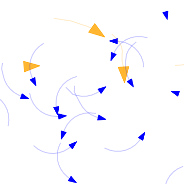

# Predator–prey survival pressure is sufficient to evolve swarming behaviors

### Team Members:
- Ariana Kržan (GitHub: @xonariah)
- Tina Brdnik (GitHub: @tinakindrb)
- Vito Levstik (GitHub: @vitolev)

### Starting Point:
We build our project on the paper *["Predator–prey survival pressure is sufficient to evolve swarming behaviors"](https://iopscience.iop.org/article/10.1088/1367-2630/acf33a)* by Jianan Li et al. (2023), which models how simple survival pressures in predator-prey dynamics can lead to the evolution of complex swarming behaviors in prey. The goal of this project was to create a realistic simulation that reflects the natural evolution of swarming behavior under survival pressure from predators. We used reinforcement learning, for the animals (agents) to learn. The expansion on the paper was introducing a new species to investigate potential emergent behaviors that could arise from interspecies interactions and also new environment variables such as obstacles that adds more realism to the simulation.

### Results overview
Unfortunately, we did not achieve the desired results. The first model we created failed to train, as the agent moved in circles.



Next, we attempted to recreate the model from the original article. While we observed some clustering of agents, the results did not match the behavior described in the original article.

The final model we developed showed much better results than the first one. After training, the agents managed to move sensibly; however, we still did not observe any swarming behavior. We introduced obstacles and a new species to the environment. These additions can serve as a foundation for further exploration in the future.


### Instruction
To run our models in the `models` folder create a new virtual environment and install requirements using
```bash
   pip install -r requirements.txt
```
The `requirements.txt` is located in the `models` folder. To run the first model look at `models/MADDPG model/Model_With_RL.ipynb` and follow along.
To run the final model look at `models/PPO model/main.py`. It contains some functions to: train new model, train old model, vizualize, ...
If you want to customize the rewards or any other environment factors look at `models/PPO model/PredatorPreyEnv.py`.

To run the model from the starting point article follow the instructions in `Gym-PPS-main` folder. It is a clone of the original repository avaiable at [this link](https://github.com/WindyLab/Gym-PPS). One thing to note if you want to run this model is that it does not work on Windows, but it works on Linux (we used WSL to run it). 

### Project Plan and Milestones:
- **[Kick-Off](https://github.com/xonariah/Collective-behaviour-project/milestone/1)
 (Oct 26, 2024):** Create the GitHub repository, identify starting research paper, and outline the project plan.
- **[First Report](https://github.com/xonariah/Collective-behaviour-project/milestone/2) (Nov 16, 2024):** Provide an overview of the swarming behavior models, review relevant literature, and draft a proposal for the methodology we will use to test our hypothesis.
- **[Second Report](https://github.com/xonariah/Collective-behaviour-project/milestone/3) (Dec 7, 2024):** Refine our methodology based on feedback from the first report, and implement the model to collect preliminary results.
- **[Final Report](https://github.com/xonariah/Collective-behaviour-project/milestone/4) (Jan 11, 2025):** Present a fully polished version of our findings, along with the final model results and conclusions.

